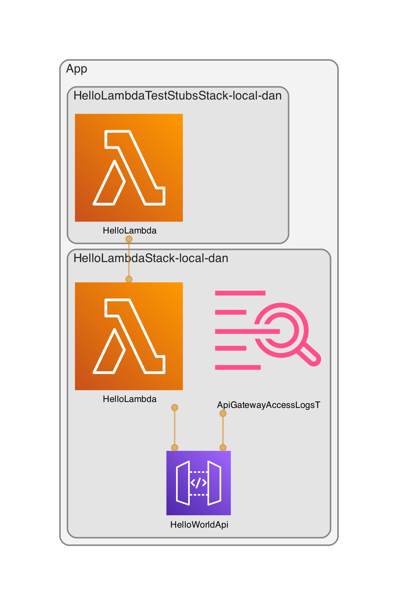

# Python/Lambda 'hello world' example


This is a small 'hello world' example I've been using to experiment with building a simple Python lambda, and trying out some of the tooling in the Python ecosystem. It hosts a GET endpoint, and makes calls to a downstream REST API to construct its response.



## Prerequisites

-   NodeJS v14+ (for CDK)
-   Docker (for CDK)
-   AWS CLI
-   Python 3.9

## Getting started

```
npm install -g aws-cdk cdk-dia          # install CDK CLI tool and diagram generation tool
python -m venv .venv                    # create virtual environment
source .venv/bin/activate               # activate virtual environment
make install                            # install packages
pre-commit install                      # set up git hooks
```

## Features

-   Bundled VS Code settings to standardise everyone's dev experience
-   Makefile to make running common commands easier
-   Uses various linting and code style tools to automatically keep the codebase clean
-   Uses git hooks to check code before it is committed
-   Uses CDK to define infrastructure as code
-   Secured by an API key
-   Pytest unit tests with full coverage - external dependencies such as HTTP calls are stubbed
-   Nightly mutation testing to ensure the unit tests cover all functionality
-   Pytest integration tests that run on real AWS infrastructure, with stubbed HTTP dependencies for isolated testing
-   Each developer gets their own, isolated AWS environment for running tests and exploratory testing
-   GitHub Actions workflows to run checks and deploy
-   Smoke tests after deploying to each environment
-   Nightly dependency checks to detect the use of insecure packages
-   Static analysis for security issues using Bandit
-   ZAP scans used to test the deployed API for vulnerabilities
-   CDK automatically checked for best practice and security issues
-   OpenAPI specification that is automatically tested against the API for accuracy
-   Automatically generated HTML API documentation
-   Machine-generated CDK diagram

## TODO

-   Make CDK diagram update automatically when infra is changed
-   Some work to do to tighten security of CDK and remove cdk-nag rule exclusions

## Run checks and unit tests

`make checks`

## Run all tests (including integration)

Configure AWS credentials, then:

`make all-tests`

Code will be automatically deployed to your personal local environment

## Run schema tests (Schemathesis)

These tests ensure that the OpenAPI spec matches the API's actual schema, and also perform some fuzz testing against the API.

`make schemathesis`

## Run API security tests (ZAP scan)

These tests scan the API for security issues.

`make zap-scan`

## Run mutation tests

These tests introduce "mutations" into the codebase to check that the unit tests cover everything they should be covering.

`make mutation-tests`

## Deploy to your personal local environment

This deploys the code to your own, personal environment in AWS, so you can run tests against it without impacting other developers.

`make deploy`

## Deploy to another environment

`DEPLOY_ENVIRONMENT=dev make deploy`
